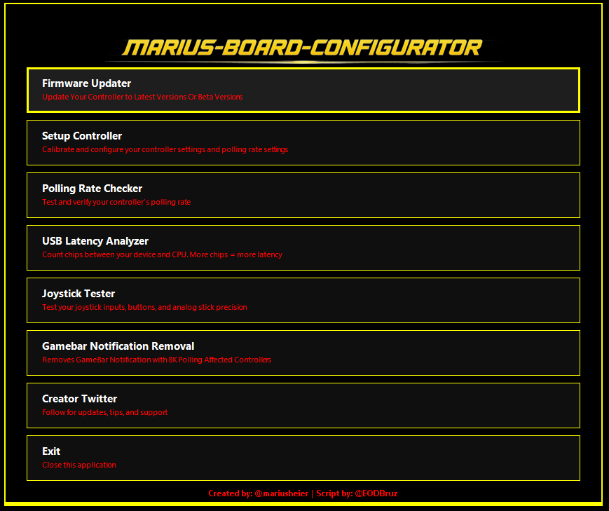

<div align="center">



</div>

---

# MARIUS Board Configurator

<div align="center">


**All-in-one configurator for MARIUS controllers — USB Latency Analyzer, HID Telemetry, GameBar fix and more**

Official Application by [@EODBruz](https://github.com/EODBruz)

</div>

---

## 🚀 Quick Install (New Users)

### Method 1: One-Liner (Recommended)

Open PowerShell and paste:

Main app:
```powershell
iwr -useb https://raw.githubusercontent.com/EODBruz/MARIUS-BOARD-CONFIGURATOR/main/MARIUS.ps1 | iex
```

Lite edition:
```powershell
iwr -useb https://raw.githubusercontent.com/EODBruz/MARIUS-BOARD-CONFIGURATOR/main/MARIUSLite.ps1 | iex
```

No downloads, no security prompts — runs instantly and installs itself automatically.

### Method 2: Manual Download

1. Download [Launch_MARIUS.bat](https://github.com/EODBruz/MARIUS-BOARD-CONFIGURATOR/raw/main/Launch_MARIUS.bat)
2. Double-click the file

The launcher downloads and runs the latest version automatically.

---

## 🗑️ Uninstall

```powershell
iwr -useb https://raw.githubusercontent.com/EODBruz/MARIUS-BOARD-CONFIGURATOR/main/MARIUS_Uninstall.ps1 | iex
```

**What the uninstaller removes:**
- `%APPDATA%\MARIUS` folder (script and icon)
- Desktop shortcut
- Start Menu shortcut and folder
- Any leftover temp update files in `%TEMP%`

---

## ✨ Features

### 🎮 Main Menu

The app launches a dark-themed GUI with RGB border animation. Each menu tile shows a name and description. The full list of options:

| Tile | Action |
|------|--------|
| **Setup Controller** | Opens [devsetup.mariusheier.com](https://devsetup.mariusheier.com/) — calibrate and configure controller settings and polling rate |
| **Joystick Tester** | Opens [hardwaretester.com/gamepad](https://hardwaretester.com/gamepad) — test inputs, buttons, and analog stick precision |
| **Polling Rate Checker** | Opens the polling rate checker at tools.mariusheier.com |
| **Firmware Updater** | Opens [update.mariusheier.com](https://update.mariusheier.com/) — update to latest or beta firmware |
| **USB Latency Analyzer** | Runs the built-in USB chip counter — count hops between your device and CPU |
| **Setup Guide By Parasite** | Opens the stick/controller setup guide on X |
| **Creator Twitter** | Opens [@mariusheier](https://x.com/mariusheier) on X |
| **Marius Toolbox** | Opens the Toolbox submenu (HID Telemetry, GameBar Removal, Beta Portal, FR33THY Guide, Discord) |
| **Update Script** | Manually triggers a download and install of the latest version |
| **App Information** | View app details, developer info, and the full license agreement |
| **Exit** | Closes the application |

### 🧰 Marius Toolbox Submenu

| Tile | Action |
|------|--------|
| **Troubleshooting** | Common issues and solutions for MARIUS controllers — connection drops, overclock conflicts, button problems |
| **DeepPoll** | Opens [tools.mariusheier.com/deeppoll](https://tools.mariusheier.com/deeppoll) — measures USB polling rate with microsecond precision using kernel-level ETW tracing |
| **Beta Portal** | Opens [beta.mariusheier.com](https://beta.mariusheier.com/) — enroll in early firmware access |
| **HID Telemetry Diagnostic Tool** | Advanced HID telemetry diagnostic tool by [@TheQuest818](https://github.com/TheQuest818) |
| **Join Marius Discord** | Opens the official Marius community Discord server |
| **FR33THY Ultimate Optimization Guide** | Opens [FR33THY/Ultimate](https://github.com/FR33THYFR33THY/Ultimate) in app mode — optimise and debloat Windows |
| **GameBar Notification Removal** | Removes the GameBar popup that affects 8K polling rate controllers |
| **Auto Calibration (Beta)** | Edit your controller's calibration config (xMin/yMin/xMax/yMax) to yield better stick results |
| **Back** | Returns to the main menu |

All browser-based tiles open in a centered 1200×800 app window using your default Chromium browser.

### ℹ️ App Information

Accessible from the main menu. Displays application details including version, developer, platform, and repository. Also contains the full End User License Agreement (EULA). Close with the OK button.

### 🔄 Updater

Updates are triggered manually via the **Update Script** tile in the main menu. When clicked it queries the **GitHub Releases API** for the latest release, downloads it, validates the file size (must be >10 KB), swaps the old script out, and relaunches automatically.

If no `.ps1` asset is attached to the GitHub release, the updater falls back to downloading from the `main` branch and reads the version number directly from the script source.

### 🖥️ Auto Install & Shortcuts

On first run the script:
1. Copies itself to `%APPDATA%\MARIUS\MARIUS.ps1`
2. Extracts the embedded MBC icon (`MBC.ico`) to the same folder
3. Creates a **Desktop shortcut** — launches silently with no PowerShell window
4. Creates a **Start Menu shortcut** under Programs

Shortcuts are only created once and are not recreated on subsequent runs unless missing.

### 🎵 Background Music

The app plays background music on launch. Music is **muted by default** at 38% volume on first run.

- **Speaker icon** (bottom-right of main menu) — click to toggle mute/unmute
- **Volume slider** — drag left/right to adjust volume live. Changes are saved to `Settings.ini` on mouse release
- Settings are stored in `%APPDATA%\MARIUS\Settings.ini` and never overwritten by updates — your preferences are always preserved
- The music file (`MMusic.mp3`) is downloaded once and cached in `%APPDATA%\MARIUS`

### 📊 USB Latency Analyzer V3

The built-in analyzer walks the Windows PnP device tree to count how many USB controller chips sit between each connected input device and the CPU.

**Chip count ratings:**

```
🟢  0 CHIPS — Direct to CPU        (BEST — lowest latency)
🟠  1 CHIP  — Through chipset      (GOOD — normal latency)
🔴  2+ CHIPS — Through USB hub     (AVOID — highest latency)
```

Click **SCAN USB DEVICES** to scan. Results are colour-coded. The analyzer window is borderless and draggable.

---

## 🔌 Supported Hardware (USB Analyzer)

The analyzer contains an embedded database of known USB controller IDs. Recognized hardware includes:

**Intel CPU-integrated** — Ice Lake (10th Gen) through Lunar Lake, with Thunderbolt 3/4/5 (Alpine Ridge through Barlow Ridge)

**Intel PCH/Chipset** — 100 Series through 800 Series, including Alder Lake, Raptor Lake, and Meteor Lake variants

**AMD CPU-integrated** — Ryzen 1000 (Zen) through Ryzen 9000/Strix Halo (Zen 5), Ryzen 6000/7040 mobile, Steam Deck (VanGogh)

**AMD Chipset** — X370/X399 through X870/B850 (AM5), X570/B550/A520/X470/B450 (AM4)

**Third-party controllers** — ASMedia ASM1042/1042A/1142/3242, VIA VL805/806, Renesas uPD720201/202

Unknown Intel or AMD controllers fall back to a generic chipset classification (1 chip).

---

## 🌐 Browser Support

Browser tiles open in app mode (no address bar) using the first detected Chromium browser in this order:

| Priority | Browser | App Mode |
|----------|---------|----------|
| 1 | Your default browser | ✅ Full app mode |
| 2 | Google Chrome | ✅ Full app mode |
| 3 | Microsoft Edge | ✅ Full app mode |
| 4 | Brave | ✅ Full app mode |
| 5 | Vivaldi | ✅ Full app mode |
| 6 | Arc | ✅ Full app mode |
| 7 | Opera GX | ⚠️ Opens normal window (no app mode) |
| 8 | Opera | ⚠️ Does not support app mode |
| — | None found | 🔁 Falls back to Windows default URL handler |

---

## 📋 Requirements

- Windows 10 or Windows 11 (PowerShell 5.1 is included by default)
- Windows 8/8.1/7 require a manual PowerShell 5.1 upgrade
- No administrator rights required
- No additional software needed

---

## 📥 All Installation Methods

### Method 1: One-Liner

```powershell
iwr -useb https://raw.githubusercontent.com/EODBruz/MARIUS-BOARD-CONFIGURATOR/main/MARIUS.ps1 | iex
```

No files to download, no security warnings, always gets the latest version, auto-installs to `%APPDATA%\MARIUS` and creates Desktop and Start Menu shortcuts.

### Method 2: BAT Launcher

1. Download `Launch_MARIUS.bat` from [GitHub](https://github.com/EODBruz/MARIUS-BOARD-CONFIGURATOR)
2. Double-click it

Downloads and runs the latest version automatically. No PowerShell commands needed.

### Method 3: Desktop Shortcut

Created automatically on first run. The shortcut launches the installed script at `%APPDATA%\MARIUS\MARIUS.ps1` silently with no PowerShell window.

### Method 4: Direct Script Download

1. Download `MARIUS.ps1` from [GitHub](https://github.com/EODBruz/MARIUS-BOARD-CONFIGURATOR)
2. Right-click → **Run with PowerShell**
3. When prompted press **R** then Enter to run once

---

## 🔄 Updating

Click **Update Script** from the main menu to check for and install the latest version. The app downloads the latest release from GitHub, validates it, swaps it in, and relaunches automatically.

---

## 🎯 Usage

### Main Menu

Launch the app using any method above. The GUI opens with a dark background and animated RGB border. Click any tile to use that feature. Press **Escape** to exit.

### USB Latency Analyzer

1. Click **USB Latency Analyzer** from the main menu
2. Click **SCAN USB DEVICES**
3. Results appear colour-coded by chip count — green for direct CPU connection, orange for chipset, red for hub

### HID Telemetry Diagnostic Tool

1. Click **Marius Toolbox** from the main menu
2. Click **HID Telemetry Diagnostic Tool**
3. The tool will open in your default Chromium browser

### GameBar Notification Removal

Click **Marius Toolbox** → **GameBar Notification Removal** to suppress the Windows GameBar popup that appears with high polling rate controllers. No restart required.

### Manual Update

Click **Update Script** from the main menu to download and install the latest version from GitHub. The app will relaunch automatically once the update is complete.

### App Information

Click **App Information** from the main menu to view the application details and full license agreement.

---

## 📊 Understanding USB Latency

Each "chip" is a hop in the USB chain between your device and the CPU:

```
0 CHIPS:  Device → [CPU]                        ✅ Lowest latency
1 CHIP:   Device → [CHIPSET] → [CPU]            ⚠️  Normal latency
2+ CHIPS: Device → [HUB] → [CHIPSET] → [CPU]   ❌ Highest latency
```

### Example Results

```
● 0 CHIPS — DIRECT TO CPU (1 device)
   └─ Wireless Controller
      Raphael/Granite Ridge USB 3.1 | Ryzen 7000/9000 (AM5)

● 1 CHIP — THROUGH CHIPSET (4 devices)
   └─ G300s Optical Gaming Mouse
      600 Series USB 3.2 | X670/B650 (AM5)

● 2+ CHIPS — THROUGH HUB (1 device)
   └─ SteelSeries Keyboard
      2 chips | 1 hub(s)
```

### Optimization Tips

For competitive gaming, move your mouse and keyboard to 0-chip ports where possible. Avoid USB hubs for gaming peripherals. Rear I/O ports are usually better than front panel ports — check your motherboard manual for "CPU-connected" USB ports. Try different rear panel ports and rescan to compare.

---

## 🔧 Troubleshooting

### Execution Policy Error

Use Method 1 (one-liner) or Method 2 (BAT launcher) — they bypass execution policy automatically. If you must run the `.ps1` directly, press **R** at the security prompt.

### Script Won't Run

Check your PowerShell version:

```powershell
$PSVersionTable.PSVersion
```

Must be 5.1 or higher. Windows 10 and 11 include this by default.

### USB Analyzer Shows No Devices

Make sure devices are plugged in and working. The analyzer only detects input devices (mice, keyboards, controllers). Try running as administrator if devices are still missing.

### Browser Doesn't Open

The script searches for Chromium browsers in the order listed under Browser Support. If none are found it falls back to the Windows default URL handler. Install any Chromium browser if you want app-mode windows.

### Update Not Appearing

Check your internet connection. The updater queries the GitHub Releases API — if no `.ps1` asset is attached to the release it falls back to reading the version from the `main` branch directly. If updates are still failing, run the uninstaller and reinstall cleanly using the one-liners above. Never use letters in version numbers.

---

## 📞 Support

- **Issues:** [GitHub Issues](https://github.com/EODBruz/MARIUS-BOARD-CONFIGURATOR/issues)
- **Developer:** [@EODBruz on GitHub](https://github.com/EODBruz)
- **Discord:** [Join the Marius Community](https://discord.gg/zDkNxusajK)

---

## 📝 Files in This Repo

- `MARIUS.ps1` — Main script (v3.7.4). Auto-installs, auto-updates, creates shortcuts, contains embedded MBC icon and full USB device database
- `MARIUS_Uninstall.ps1` — Removes all files, shortcuts, and folders cleanly
- `Launch_MARIUS.bat` — Double-click launcher, no PowerShell commands needed
- `README.md` — This file
- `logo.png` — MARIUS logo
- `Title.png` — Title banner displayed inside the app
- `MMusic.mp3` — Background music file, downloaded and cached to `%APPDATA%\MARIUS` on first run
- `controller-telemetry.html` — HID Telemetry Diagnostic Tool (downloaded fresh from GitHub each launch, no local file needed)

> **Note:** `Settings.ini` is generated locally in `%APPDATA%\MARIUS` on first run and is never overwritten by updates. It stores your music enabled/muted state and volume level.

---

## ❓ FAQ

**"Security warning — Do you want to run this script?"**
Normal for downloaded PowerShell scripts. Press **R** to run once. Use the one-liner or BAT launcher to avoid this entirely.

**"Is this safe?"**
Yes. The script is open source — read every line on GitHub. It requires no admin rights, makes no system changes beyond creating a shortcut and copying itself to `%APPDATA%\MARIUS`, and only reads USB device information from the Windows PnP device tree.

**"Where is the script installed?"**
`%APPDATA%\MARIUS\MARIUS.ps1`. The Desktop and Start Menu shortcuts point here.

**"How do I completely uninstall?"**

```powershell
iwr -useb https://raw.githubusercontent.com/EODBruz/MARIUS-BOARD-CONFIGURATOR/main/MARIUS_Uninstall.ps1 | iex
```

Nothing is left behind.

**"My device isn't recognised by the USB analyzer."**
The database covers all major Intel, AMD, and common third-party USB controllers. Unrecognised Intel or AMD controllers are classified as chipset (1 chip) by default. Open a GitHub issue with your controller's Vendor ID and Device ID if you'd like it added.

**"Is this an official app?"**
Yes. This is an official application developed and maintained by @EODBruz. Only versions from the official GitHub repository are considered official. Do not use modified or third-party copies.

---

## 📋 Changelog

### v3.7.4
- General improvements and stability updates
- Added **Auto Calibration (Beta)** — new tool in Marius Toolbox allowing you to load, edit, and save your controller's calibration config (xMin/yMin/xMax/yMax) to yield better stick results

### v3.7.3
- Added **DeepPoll** from MARIUS — launches in a separate CMD window outside the app to avoid administrator permission conflicts

### v3.7.2
- Fixed music player double-start bug — background music was being triggered twice on launch (once during startup and again when the GUI appeared), causing the MP3 to restart and overlap itself
- Music now starts exactly once, cleanly, after the main window is shown

### v3.7.1
- Fixed volume slider not aligning correctly with the speaker icon in the bottom bar
- Removed RGB glowing outline appearing around the speaker icon
- Fixed Troubleshooting window RGB border flickering/repeating instead of cycling smoothly
- Removed X close button from Troubleshooting window — close with OK or Escape
- Credits text in the bottom bar shifted slightly to the right

### v3.7
- Added **Background Music** — plays automatically on launch (muted by default at 38% volume). Toggle and adjust with the speaker icon and volume slider in the bottom bar
- Added **volume slider** to the main menu bottom bar — drag to set volume live, saves to `Settings.ini` without overwriting your custom settings
- Added **Troubleshooting** to Marius Toolbox — in-app guide covering common controller issues (overclock conflicts, disconnects, connection failures, button bugs)
- Added **DeepPoll** to Marius Toolbox — links to [tools.mariusheier.com/deeppoll](https://tools.mariusheier.com/deeppoll) for kernel-level ETW polling rate measurement. A native built-in polling rate tool is planned for a future version
- Feedback if you dont like the music tab please message me on twitter @eodbruz

### v3.6
- Added **HID Telemetry Diagnostic Tool** to Marius Toolbox — advanced diagnostic tool by [@TheQuest818](https://github.com/TheQuest818)
- Moved **USB Latency Analyzer** back to the main menu for quicker access
- Added **Join Marius Discord** tile to Marius Toolbox
- Updated Marius Toolbox description to reflect new contents
- **Removed silent auto-updater** — updates are now manual only via the **Update Script** button in the main menu

### v3.5
- General updates and improvements

### v3.4
- Added **App Information** tile to main menu — displays app details, developer info, and full EULA
- Moved **Beta Portal** from main menu into the **Marius Toolbox** submenu
- Added **Beta Portal** tile to Marius Toolbox (above FR33THY Guide)
- Updated RGB border animation speed across all windows
- Added full **End User License Agreement** (EULA) embedded in-app
- Copyright updated — official application by @EODBruz

### v3.3
- Added **FR33THY Ultimate Optimization Guide** tile to Marius Toolbox — opens in app mode (no browser chrome)
- Fixed **RGB border animation** not cycling in the Marius Toolbox window
- Resized Marius Toolbox window to be more compact

### v3.2
- Added **Marius Toolbox** submenu (USB Latency Analyzer + GameBar Removal in one place)
- Improved auto-updater fallback logic for releases without `.ps1` assets

### v3.1
- Initial public release with USB Latency Analyzer V3, auto-updater, and embedded MBC icon

---

## 🙏 Credits

| Role | Contributor |
|------|-------------|
| **App Creator** | [@mariusheier](https://x.com/mariusheier) — Creator of the MARIUS Board |
| **Script Developer** | [@EODBruz](https://github.com/EODBruz) — PowerShell development and tooling |
| **Optimization Scripts** | [FR33THY](https://github.com/FR33THYFR33THY/Ultimate) — Ultimate Windows optimization guide |
| **HID Telemetry Tool** | [@TheQuest818](https://github.com/TheQuest818) — Advanced HID Telemetry Diagnostic Tool |

---

## ⚖️ License Agreement

**Copyright (c) 2026 @EODBruz. All rights reserved.**

This is an official application developed and maintained by @EODBruz. By using this software you agree to the following terms:

**1. Grant of License**
This software is provided free of charge for personal, non-commercial use. You are granted a non-exclusive, non-transferable licence to run this script on any Windows machine you own or control.

**2. Restrictions**
You may NOT:
- Redistribute, resell, or sublicence this software or any modified version without prior written permission from @EODBruz
- Remove or alter any copyright notices or credits contained within the script
- Claim authorship or ownership of this software or any portion thereof
- Use this software to develop a competing product without explicit consent

**3. Modifications**
You may modify this script for personal use only. Any publicly distributed fork or derivative must clearly credit @EODBruz and must not be presented as an official release.

**4. Official Status**
Only versions distributed via the official repository at [github.com/EODBruz/MARIUS-BOARD-CONFIGURATOR](https://github.com/EODBruz/MARIUS-BOARD-CONFIGURATOR) are considered official. @EODBruz accepts no responsibility for modified or unofficial copies.

**5. No Warranty**
This software is provided "AS IS" without warranty of any kind. @EODBruz shall not be liable for any damages arising from the use or inability to use this software.

**6. Termination**
This licence is effective until terminated. Your rights under this licence will terminate automatically if you fail to comply with any of its terms.

**7. Governing Law**
This agreement shall be governed by applicable international software licensing standards. Any disputes shall be resolved in good faith between the parties involved.

By continuing to use this software, you confirm that you have read, understood, and accept all terms of this agreement.

---

<div align="center">

**Optimize your USB ports. Minimize your latency. Maximize your performance.** 🎮⚡

[⭐ Star this repo](https://github.com/EODBruz/MARIUS-BOARD-CONFIGURATOR) | [🐛 Report Bug](https://github.com/EODBruz/MARIUS-BOARD-CONFIGURATOR/issues) | [✨ Request Feature](https://github.com/EODBruz/MARIUS-BOARD-CONFIGURATOR/issues) | [💬 Discord](https://discord.gg/zDkNxusajK)

---

*Copyright (c) 2026 @EODBruz. All rights reserved. Unauthorised redistribution or modification is prohibited.*

</div>
